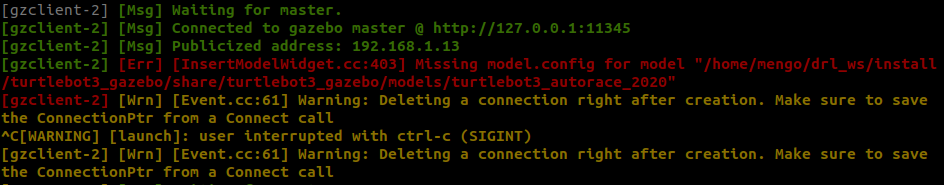

# Preview

This repository implements deep reinforcement learning for turlebot3 navigation tasks using Stable Baselines3.


# Best model

# Best model

The model that you can see in the [video](docs/Preview.mp4), can be found [here](rl_models/best_model/balmy-sea-253). This model have been trained with a continual learning approach, totalling approximatly 750000 steps:

1. Learn to maximize forward motion, minimizing angular velocity.
2. Learn to avoid obstacles.
3. Learn to reach the goal position. 


# Acknowledgements
This repository is inspired by [TannerGilbert/Turtlebot3-DRL-Navigation](https://github.com/TannerGilbert/Turtlebot3-DRL-Navigation). Changes have been done to implement the training with Stable Baselines3 and Wandb.

# Installation
>[!IMPORTANT]
> The repository has been tested on ROS Humble 

>[!NOTE]
>The repository also contains a [Dockerfile](Dockerfile): see [Docker Installation](#docker-installation)

Supposing ROS Humble is already installed on your machine, follow the next steps.


### Install Gazebo Classic and Turtlebot3 packages
To install gazebo:
```
sudo apt-get update
```

```
sudo apt-get install -y \
ros-humble-gazebo* \
ros-humble-dynamixel-sdk \
ros-humble-turtlebot3-msgs \
ros-humble-turtlebot3 
```

### Install Stable Baselines 3
To install SB3, first install its dependencies:

```
sudo apt-get update
```

```
sudo apt-get install -y \
python3 \
python3-pip \
python3-venv \

```

Then the SB3 package:

```
pip install --upgrade pip \
&& pip install --ignore-installed sympy \
stable-baselines3[extra]
```
>[!NOTE]
> The `--ignore-installed sympy` solved a compatibility problem in my case.

### Install other dependencies
```
pip install wandb tabulate
```

### Clone the needed repositories
Now create your workspace:

```
mkdir -p ~/drl_nav_ws/src
cd ~/drl_nav_ws/src
```

And clone the [drl_navigation](https://github.com/RiccardoMengozzi/drl_navigation) and [turlebot3_simulation](https://github.com/ROBOTIS-GIT/turtlebot3_simulations/tree/main) repositories:

```
git clone -b humble-devel https://github.com/ROBOTIS-GIT/turtlebot3_simulations.git
git clone https://github.com/RiccardoMengozzi/drl_navigation.git

```

Finally in `~/drl_nav_ws`:

```
rosdep update
rosdep install -i --from-path src --rosdistro humble -y
```


>[!CAUTION]
> During the installation of `turtlebot3_simulations` an error occured in my case:



This was due to the fact that a `model.config` was lacking from `turlebot3_autorace_2020` model. To solve this, just add the following `model.config` file in the [turtlebot3_autorace_2020](https://github.com/ROBOTIS-GIT/turtlebot3_simulations/tree/main/turtlebot3_gazebo/models/turtlebot3_autorace_2020) model.


```
<?xml version="1.0"?>
<model>
  <name>TurtleBot3 AutoRace 2020</name>
  <version>1.0</version>
  <sdf version="1.6">model.sdf</sdf> <!-- If you have a top-level SDF file -->
  <description>AutoRace 2020 environment for TurtleBot3</description>
</model>
```

# Train Usage
## Imposta wandb e tutti i parameteri
## Train usage: fai partire simulation, fai partire agent, 

# Test usage
## load the model
## fai partire simulation, fai partire test.


# Docker installation
Either pull the image from DockerHub:
```
docker pull riccardomengozzi/drl-navigation:latest
```
Or build the image from the [Dockerfile](Dockerfile).
In `~/drl_nav_ws/src/drl_navigation` run:
```
ocker build --build-arg CACHE_BUST=$(date +%s) -t img:latest .
```
>[!NOTE]
> THE `--build-arg CACHE_BUST=$(date +%s)` is needed to make sure the clones repositories are always updated.

# Docker usage
Once the docker image is built properly in your machine, to run the container, since GUI applications (Gazebo, Rviz2) are present, some extra steps are needed.

First of all, in your terminal run:
```
xhost +local:root
```
To give root permissions.

Then, the `docker run` command  should be something like:

```
docker run -it --network=host --ipc=host -v /tmp/.X11-unix:/tmp/.X11-unix:rw --env=DISPLAY --env="QT_X11_NO_MITSHM=1" --device=/dev/dri:/dev/dri img

```
>[!NOTE]
> The command `--device=/dev/dri:/dev/dri` is needed to use the GPU for GUI applications.

>[!IMPORTANT]
> If you have CUDA, you would probably need these other commands to be able to use it for training:

```
docker run -it --network=host --ipc=host -v /tmp/.X11-unix:/tmp/.X11-unix:rw --env=DISPLAY --gpus all --runtime=nvidia --env="QT_X11_NO_MITSHM=1" --env="NVIDIA_DRIVER_CAPABILITIES=all" --env="NVIDIA_VISIBLE_DEVICES=all" --device=/dev/dri:/dev/dri img

```

Also, during training, you would also need to share folders between the container and the host machine to save models, logs etc...
To do that, add these commands:

```
docker run -it -v $PWD/src/drl_navigation/rl_logs:/ros_ws/src/drl_navigation/rl_logs -v $PWD/src/drl_navigation/rl_models:/ros_ws/src/drl_navigation/rl_models -v $PWD/wandb:/ros_ws/wandb --network=host --ipc=host -v /tmp/.X11-unix:/tmp/.X11-unix:rw --env=DISPLAY --gpus all --runtime=nvidia --env="QT_X11_NO_MITSHM=1" --env="NVIDIA_DRIVER_CAPABILITIES=all" --env="NVIDIA_VISIBLE_DEVICES=all" --device=/dev/dri:/dev/dri img
```


